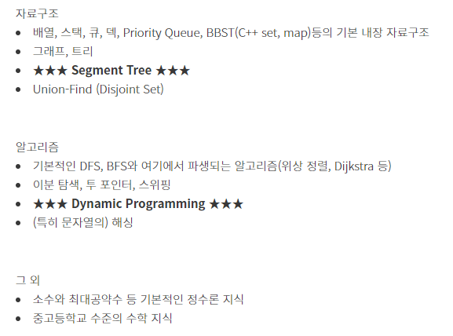

# 2023.03.01 다시 ps 시작
## 문제의식
개발을 지속하다보니, 내게 구현능력과 문제해결능력이 사뭇 부족하다고 느껴진다.  
  
문제를 해결하는데 생각보다 시간이 오래 걸리는 경우가 많은것이 그 증거.  
이는 '구현능력' 과 '문제해결능력' 모두 부족한 것이 원인이라 생각하므로, 다시 PS(problem solving) 연습을 시작하기로 하였다.  
(빡빡한 업무 사이에 뇌를 말랑말랑하게 해주는 효과도 있다...)  
  
문제만 냅다 풀었던 과거와 달리, 조금은 체계적인 방법이 필요하다 느꼈다. ps블로거 Subinium 님의 [PS를 공부하는 법](https://subinium.github.io/how-to-study-problem-solving/#%EC%97%B0%EA%B4%80%EA%B0%9C%EC%9D%B8%EA%B8%80) 을 보고 느끼는바가 많았다.

## 원칙
1. 구현능력부터 기른다
  - 작년에 한창 leetcode daily challenge를 진행했을 때 느낀바로는, 문제를 빠르게 풀지 못하는 가장 큰 이유가 '풀이는 생각나는데 어떻게 구현할지 몰라서' 였다.
2. 새로운 알고리즘을 공부하면 10문제를 풀어본다
  - 난 지루함을 빨리 느낀다 (오만하기 그지 없다). 새로운 것을 공부하고 깔짝 3,4 문제 풀고 다음 new one 을 찾으려는 습성이 있으므로, 원칙으로서 이를 저지한다. 
3. leetcode daily 를 빼먹지 않는다
  - leetcode daily 는 다양한 장르의 문제를 풀어볼 수 있는 아주아주아주 고마운 시스템이다. 이를 빼먹지 않고 풀다보면 편향되지 않게 공부할 수 있고, monthly badge 도 주기 때문에 좋은 동기부여가 된다.
4. 문제 고민은 1시간을 넘기지 않는다
  - 문제 푸는 방법에 대해 1시간 이상 고민해야 한다면... 못푸는 문제다. 이땐, 배경지식을 먼저 쌓는것이 선행되어야 한다. `원칙2`로 이어진다.

## 공부 방법
1. 평일엔 solved.ac 랭작
  - 구현능력을 기르려면 문제를 많-이 풀어야 한다
  - 경쟁은 좋은 동기부여 도구다. [PS를 공부하는 법](https://subinium.github.io/how-to-study-problem-solving/#%EC%97%B0%EA%B4%80%EA%B0%9C%EC%9D%B8%EA%B8%80)의 조언에 따라, 백준에서 1000명 이상이 푼 문제 위주로 하루 5문제를 목표로 하자.
  - 3월 한 달, 플래티넘 진입을 목표로 한다.
  - 랭작 만큼은 새로운 알고리즘 공부 보단 **개념은 알지만 구현이 어려운 문제** 를 해결한다
  - 문제 set
    - [USACO BRONZE 통과의 지름길](https://www.acmicpc.net/workbook/view/6153)
    - [지허모 문제집](https://www.acmicpc.net/group/workbook/12703)
    - [solved.ac CLASS 4](https://solved.ac/class)
2. 주말엔 부족한 배경지식 공부
  - 문제만 냅다 풀면, 내가 모르는 지식을 습득하긴 어렵다. 주말을 이용해 공부하자
  - 아래의 알고리즘 중, 부족한 부분을 채우자
  - **꼭** 알아야 하는 알고리즘
    

# 도움받은 블로그
- 안즈 - [PS를 공부하는 뉴비들을 위한 안내서](https://anz1217.tistory.com/147)
- Subinium - [PS를 공부하는 법](https://subinium.github.io/how-to-study-problem-solving/#%EC%97%B0%EA%B4%80%EA%B0%9C%EC%9D%B8%EA%B8%80)